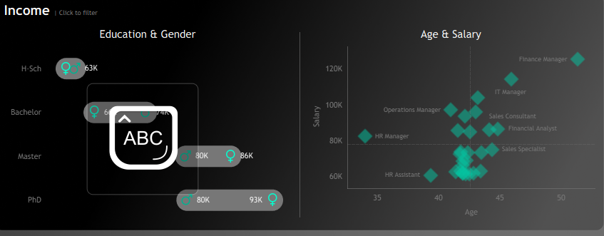

# 🚀 HR Analytics Dashboard (Tableau)

📊 Interactive HR dashboard analyzing workforce, attrition, and salary trends using Tableau.

## 📌 Project Overview
This project presents an **interactive HR Analytics Dashboard** built using Tableau to analyze employee data and derive meaningful insights related to workforce distribution, attrition, hiring trends, and performance.

The dataset is **synthetically generated using Python** to simulate real-world HR data, ensuring realistic patterns in employee demographics, salaries, departments, and employment status.

---

## 🎯 Objectives
- Analyze employee distribution across departments and locations  
- Track hiring trends over time  
- Identify attrition patterns and employee turnover  
- Evaluate salary distribution and performance ratings  
- Provide actionable insights for HR decision-making  

---

## 🛠️ Tools & Technologies
- **Tableau** – Dashboard creation & visualization  
- **Python** – Data generation  
- **Pandas** – Data handling  
- **Faker** – Synthetic data generation  
- **GitHub** – Version control & project showcase  

---

## 📂 Project Structure
```
HR-Analytics-Dashboard/
│
├── hr_dashboard.twbx
├── hr_dataset.csv
├── generate_hr_data.py
├── images/
│   ├── dashboard_overview.png
│   ├── employee_overview.png
│   ├── attrition.png
│   └── salary_performance.png
└── Dashboard mockup.drawio
```

---

## 📸 Dashboard Screenshots

Below are key views of the HR Analytics Dashboard highlighting different insights:

### 🔹 Full Dashboard Overview

### 🔹 Full Dashboard Overview


### 🔹 Employee & Department Analysis


### 🔹 Attrition Insights


### 🔹 Salary & Performance


---

## 📊 Dashboard Features
- 👥 **Employee Overview**  
  Total employees, active vs terminated  

- 🏢 **Department Analysis**  
  Workforce distribution across departments  

- 📈 **Hiring Trends**  
  Year-wise hiring patterns  

- 💰 **Salary Insights**  
  Salary distribution across roles  

- ⚡ **Performance Analysis**  
  Employee performance ratings  

- 🔄 **Attrition Analysis**  
  Termination trends and employee turnover  

---

## ⚙️ How to Run the Project

### 1️⃣ Open Dashboard
- Download `hr_dashboard.twbx`
- Open using **Tableau Desktop / Tableau Public**

### 2️⃣ Generate Dataset (Optional)
```bash
pip install pandas faker
python generate_hr_data.py
```

---

## 📈 Key Insights
- IT and Sales departments have the highest employee count  
- Attrition is higher among employees with less experience  
- Salary increases with role and experience level  
- Hiring trends indicate organizational growth phases  

---
## 🚀 Project Impact
- Helps HR teams understand workforce trends
- Enables data-driven decision making
- Identifies attrition patterns for better retention
---
## 🔮 Future Improvements
- Add real-world dataset integration  
- Deploy dashboard on Tableau Public  
- Add predictive analytics (attrition prediction using ML)  
- Integrate SQL-based data pipeline  

---

## 👨‍💻 Author
**Uday Kumar Vadde**  
- GitHub: https://github.com/udaykumarvadde200  
- LeetCode: https://leetcode.com/u/vadde_uday_kumar/  

---

## ⭐ If you like this project
Give it a ⭐ on GitHub and feel free to contribute!
